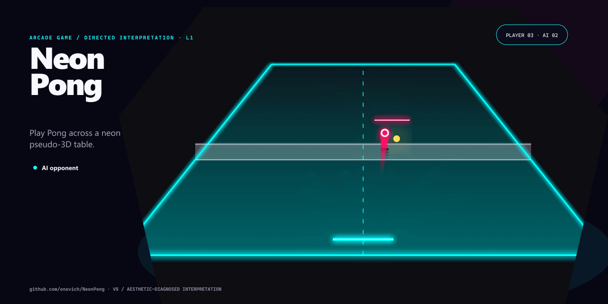

# NeonPong

[English](README.md)

带伪 3D 景深和合成波霓虹视觉的单人 Pong 网页游戏。



## 项目包含什么

- AI 对手。
- Canvas 渲染。
- 触控操作。

## 快速开始

安装依赖并启动本地版本：

```bash
npm install
npm run dev
```

仓库还提供 `npm run build`。

## 仓库结构

- `src/` — 应用与库的源代码。
- `docs/` — 项目文档与设计说明。
- `origin/` — 原始原型与设计资料。
- `.github` — 自动化与 GitHub Pages 工作流。
- `index.html` — Web 入口。

## 当前状态

仓库已经包含与上述用途对应的实现和项目材料。当前仓库没有自动化测试，评估时请在目标环境中直接运行。

## 许可证

当前仓库未包含开源许可证。
